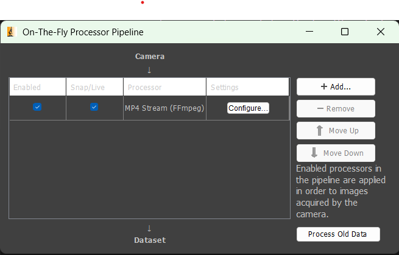

# MP4 Stream — Micro-Manager 2.x Processor Plugin

**Purpose:** Record grayscale scientific camera frames to MP4 video using CPU-only H.264 encoding (libx264), with optional timestamp and scale bar overlays.

## Why?

The traditional workflow for creating videos from microscopy is tedious:
µManager → TIFF stack → ImageJ/Fiji → adjust contrast → export → FFmpeg → finally MP4.

This plugin eliminates those steps. Common use cases:

- **Quick demos** — Show a colleague what's happening on the scope right now
- **Presentations** — Get a polished video for PowerPoint/Keynote without post-processing
- **Teaching** — Record live demonstrations for students

For quantitative analysis, you still want raw data. But when morphology and dynamics are what matters — and lossy compression is acceptable — this plugin gets you from Live mode to shareable video in seconds.

**Bit depth conversion:** Scientific cameras output 12-bit or 16-bit images, but video is 8-bit. This plugin uses Micro-Manager's display settings (the brightness/contrast sliders) to map your data to 8-bit. What you see is what you get — adjust contrast before or during recording.

**Important:** This plugin records the Live view only — the single-channel grayscale image currently displayed. Not for multi-channel acquisitions or MDA. Ideal for transmitted light (brightfield, phase contrast, DIC) or single-channel fluorescence. Output is always grayscale regardless of LUT.

## Features

- **Real-time MP4 encoding** via FFmpeg pipe (no intermediate files)
- **Three recording modes:**
  - **Constant FPS** — Maintains steady output framerate (duplicates/drops frames as needed)
  - **Real-time (VFR)** — Records every frame exactly once, preserving actual timing
  - **Time-lapse compression** — Compresses playback time (e.g., 10x = plays 10× faster)
- **Automatic segment numbering** — Prevents file overwrites, auto-increments filenames
- **Live display scaling** — Uses Micro-Manager's current brightness/contrast settings
- **Customizable overlays:**
  - **Δt timestamp** — Shows elapsed time (HH:MM:SS.mmm) in top-left corner
  - **Scale bar** — Automatic scale bar in bottom-right (uses pixel size from MM config)
  - **Text color** — White or black text with optional contrasting background
- **Immediate finalization** — MP4 closes properly when Live mode stops (event-driven)
- **Watchdog timeout** — Finalizes recording if no frames arrive (prevents hung sessions)

## Requirements

- **Micro-Manager 2.x** (tested with MM Studio 2.0.3, MMCore 11.11.0)
- **FFmpeg** — Either on system PATH or configured via settings
- **JDK 8+** for building (only if building from source)
- **Apache Ant** for building (only if building from source)

### Installing FFmpeg

FFmpeg is required for video encoding. Download and install from:

- **Windows:** [gyan.dev/ffmpeg/builds](https://www.gyan.dev/ffmpeg/builds/) — download "essentials" build, extract, add `bin/` folder to PATH
- **macOS:** `brew install ffmpeg`
- **Linux:** `sudo apt install ffmpeg` (Debian/Ubuntu) or equivalent

Verify installation: `ffmpeg -version`

Alternatively, set the full path to `ffmpeg.exe` in the plugin settings.

## Installation

### Option 1: Download Pre-built JAR (Recommended)

1. Download `MP4Stream.jar` from the [releases page](../../releases) or `build/jar/` folder
2. Copy to your Micro-Manager `mmplugins/` folder
3. Restart Micro-Manager

### Option 2: Build from Source

1. Clone this repository
2. Build: `ant jar`
3. Copy `build/jar/MP4Stream.jar` to your Micro-Manager `mmplugins/` folder
4. Restart Micro-Manager

### Enable the Plugin

**Plugins → On-The-Fly Image Processing → Configure Processor Pipeline**

Check the box next to "MP4 Stream (FFmpeg)" to enable recording.



> **Note:** My dream is for this plugin to be merged into Micro-Manager in the future. Until then, download from this repository.

## Configuration

Click the Configure... button next to the plugin to open settings:

### General Settings

| Setting | Description |
|---------|-------------|
| **Output file** | Base path for MP4 output (actual files get `_WxH_segNNN.mp4` suffix) |
| **FFmpeg path** | Path to ffmpeg.exe (leave empty to use system PATH) |
| **Recording Mode** | See Recording Modes below |
| **FPS** | Target output framerate (for Constant FPS mode) |
| **Time-lapse factor** | Playback speedup multiplier (for Time-lapse mode) |

### Overlay Settings

| Setting | Description |
|---------|-------------|
| **Show timestamp (Δt)** | Enable/disable elapsed time overlay in top-left corner |
| **Text color** | White or Black text color |
| **Font size** | Overlay text size in pixels (8-72, default 18) |
| **Contrasting background** | Adds semi-transparent background box behind text for readability |
| **Show scale bar** | Draws a scale bar in bottom-right corner (requires pixel size to be configured in MM) |
| **Scale bar length** | Fixed length in µm, or 0 for auto (~15% of image width) |

The scale bar displays in µm or mm depending on length.

### Recording Modes

All modes output video at the configured **target FPS** (default 30 fps). The modes differ in how they handle the timing of incoming frames.

#### Constant FPS (default)
- Output video plays at exactly the specified FPS
- If camera is slower: duplicates last frame to fill gaps
- If camera is faster: drops frames to match target rate
- **Best for:** Fast acquisitions where smooth playback is desired

#### Real-time (VFR)
- Every frame from the camera is written exactly once
- Playback timing matches actual capture timing
- **Best for:** Recording at maximum camera speed, preserving every frame (with compression remember)

#### Time-lapse Compression
- Compresses real time into shorter playback time
- Factor of 10× means 30 seconds of recording plays in 3 seconds
- Output FPS is still the target FPS (e.g., 30 fps)
- **Best for:** Long exposures (100ms+), time-lapses.

**Example — Time-lapse 10× with 30 fps output:**

| Camera Speed | Real Time | Frames Captured | Video Duration | Frames Written |
|--------------|-----------|-----------------|----------------|----------------|
| 1 fps (1000ms) | 30s | 30 | 3s | ~90 (duplicated) |
| 10 fps (100ms) | 30s | 300 | 3s | ~90 (some dropped) |
| 100 fps (10ms) | 30s | 3000 | 3s | ~90 (most dropped) |

**Example — Time-lapse 100× with 30 fps output (6-hour experiment):**

| Camera Speed | Real Time | Frames Captured | Video Duration | Frames Written |
|--------------|-----------|-----------------|----------------|----------------|
| 0.1 fps (10s) | 360 min | 2,160 | 3.6 min | ~6,480 (duplicated) |
| 1 fps (1s) | 360 min | 21,600 | 3.6 min | ~6,480 (some dropped) |
| 10 fps (100ms) | 360 min | 216,000 | 3.6 min | ~6,480 (most dropped) |

**Recommendation:** For fast cameras (short exposures), use **Constant FPS** or **Real-time** mode instead of Time-lapse to avoid losing frames. 

## Output Files

Files are named: `{basename}_{width}x{height}_seg{NNN}.mp4`

Example: `experiment_2304x2304_seg001.mp4`

- Segment numbers auto-increment to avoid overwrites
- New segment starts if resolution changes mid-session
- Each Live start/stop creates a new segment

## Testing

See [TESTING.md](TESTING.md) for comprehensive test checklist.

### Verified (2026-01-22)

Tested on **Windows 11** with **MM Studio 2.0.3** (nightly 20260116), **MMCore 11.11.0**, Java 11.0.27

> **Note:** Testing has only been performed on Windows 11. macOS/Linux users may encounter platform-specific issues — please report them.

**Demo Camera (512×512)**

| Test | Mode | Exposure | Frames | Result |
|------|------|----------|--------|--------|
| Basic recording | Constant 30fps | 33ms | 882 | ✓ |
| Fast camera | Constant 30fps | 10ms | 275 | ✓ Frame dropping |
| Slow camera | Constant 30fps | 500ms | 301 | ✓ Frame duplication |
| Real-time | VFR | 100ms | 99 | ✓ 1:1 capture |
| Time-lapse | 10x @30fps | 1000ms | 178 | ✓ Compression |
| Immediate finalization | Any | Any | 1 | ✓ Event-driven |

**Real Microscope — Hamamatsu ORCA-Fusion C14440-20UP**

Hardware: 2304×2304 resolution, pixel size 0.1091 µm

| Test | Mode | Frames | Result |
|------|------|--------|--------|
| Basic recording | Constant 30fps | 856 | ✓ |
| Fast camera | Constant 30fps | 249 | ✓ Frame dropping |
| Slow camera (500ms) | Constant 30fps | 271 | ✓ Frame duplication |
| Real-time (100ms) | VFR | 58 | ✓ 1:1 capture |
| Time-lapse | 10x @30fps | 179 | ✓ Compression |
| Overlay | Scale bar + timestamp | 9 | ✓ White/black text |

**Real Microscope — Photometrics Prime 95B** (MM Studio 2.0.3 nightly 20251006, MMCore 11.11.0)

Hardware: 1608×1608 resolution, Prior XY stage

| Test | Objective | Binning | Pixel Size | Scale Bar | Frames | Result |
|------|-----------|---------|------------|-----------|--------|--------|
| Recording + overlay | 10× | 1×1 | 1.12 µm | 200 µm | 115 | ✓ |
| Resolution change | 10× | 2×2 | 1.12 µm | 100 µm | 136 | ✓ |
| Objective change | 10× → 40× | 1×1 | 0.22 µm | 50 µm | 82 | ✓ |
| High magnification | 60× | 2×2 | 0.45 µm | 50 µm | 89 | ✓ |
| Binning change | 60× | 2×2 | 0.57 µm | 50 µm | 69 | ✓ |
| 40× no binning | 40× | 1×1 | 0.29 µm | 50 µm | 102 | ✓ |

## Logging & Debugging

The plugin logs to the Micro-Manager CoreLog (`Help → View Core Log...`).

**Log Levels:**
- `[IFO]` — Important events: recording start/stop, finalization
- `[dbg]` — Debug details: FFmpeg command, overlay settings, scaling changes

**Example log output:**
```
[IFO,App] [MP4Stream] Starting FFmpeg: output_2304x2304_seg001.mp4 (2304x2304, constant @30.0 fps)
[dbg,App] [MP4Stream] Overlay settings: timestamp=true (color=white, bg=true, font=18px), scalebar=true
[IFO,App] [MP4Stream] Live mode stopped - finalizing MP4 immediately.
[IFO,App] [MP4Stream] FFmpeg finalized successfully (856 frames written).
```

To enable debug logging, use Micro-Manager's debug mode or check the CoreLog after recording.

## Troubleshooting

### "FFmpeg not found"
- Ensure ffmpeg.exe is on system PATH, or
- Set explicit path in plugin settings


### Playback issues with short videos
- Videos under 1 second may not play in all players
- Use VLC for best compatibility
- Verify with `ffprobe` that file is valid

### Recording doesn't start
- Ensure plugin is enabled (checkbox checked)
- Verify output path is set and writable
- Check log for error messages

### Mode changes don't take effect
- Mode changes apply to the **next** recording, not current
- Stop and restart Live to use new settings

## Technical Details

### FFmpeg Command
```
ffmpeg -y -f rawvideo -pix_fmt gray -s WxH -r FPS -i - 
       -an -c:v libx264 -preset veryfast -crf 18 -pix_fmt yuv420p output.mp4
```

### Architecture
- `MP4StreamProcessor` — Frame processing and FFmpeg pipe management
- `MP4StreamConfigurator` — Settings UI and persistence
- `MP4StreamFactory` — Processor instantiation
- `MP4StreamPlugin` — Plugin registration

Code follows [Micro-Manager Coding Style and Conventions](https://micro-manager.org/Micro-Manager_Coding_Style_and_Conventions).

### Event Handling
- Subscribes to `LiveModeEvent` for immediate finalization
- Finalizes MP4 immediately when Live mode stops
- Watchdog thread provides backup timeout

## License

Copyright (c) 2026 Jens Eriksson

Licensed under the BSD 3-Clause License. See [LICENSE](LICENSE) file.

## Contributing

Issues and pull requests welcome. Please include:
- Micro-Manager version
- Camera model
- Relevant log excerpts
- Steps to reproduce (see [TESTING.md](TESTING.md))
